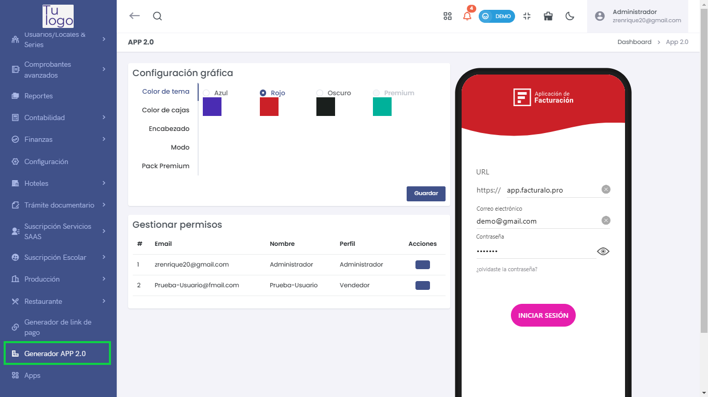
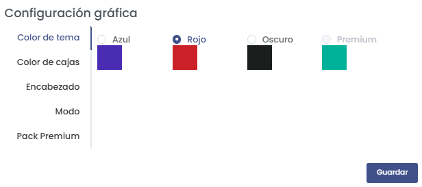
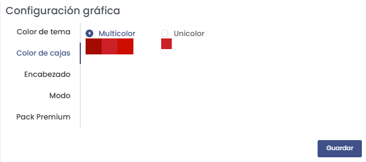
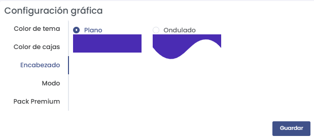
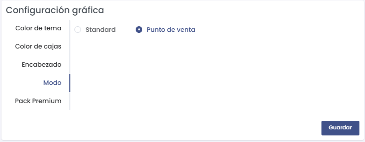
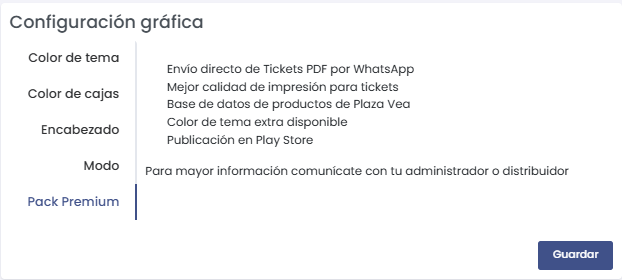
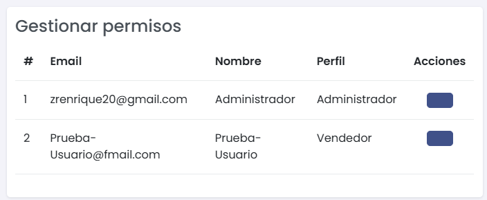
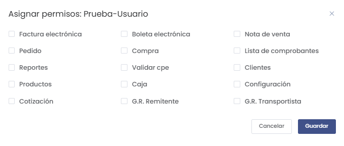

## Generador APP 2.0

El módulo **Generador APP 2.0** permite personalizar la configuración gráfica de la aplicación y gestionar los permisos de los usuarios para acceder a diferentes secciones de la aplicación. Para acceder a este módulo:

1. Dirígete al menú lateral y selecciona **Generador APP 2.0**.

Esto te llevará a la sección donde podrás configurar el aspecto visual de la aplicación y gestionar los permisos de acceso de los usuarios.

### Configuración Gráfica

En la sección de **Configuración Gráfica**, puedes realizar las siguientes personalizaciones:
- **Color de Tema**: Selecciona el color principal del tema (por ejemplo, Azul, Rojo, Oscuro, Premium).

- **Color de Cajas**: Selecciona entre opciones como **Multicolor** o **Unicolor** para las cajas de la aplicación.

- **Encabezado**: Selecciona el estilo del encabezado, ya sea **Plano** u **Ondulado**.

- **Modo**: Cambia el modo de visualización de la aplicación.

- **Pack Premium**: Accede a características adicionales del pack premium, como el envío directo de tickets PDF por WhatsApp, publicación en Play Store, entre otros.

Una vez realizadas las modificaciones deseadas, selecciona **Guardar** para aplicar los cambios.

### Gestión de Permisos

En la sección de **Gestionar Permisos**, puedes asignar permisos específicos a los usuarios registrados.

En la lista de **Usuarios** se muestra la siguiente información:
- **Email**: Correo electrónico del usuario.
- **Nombre**: Nombre del usuario.
- **Perfil**: Rol asignado al usuario (por ejemplo, Administrador, Vendedor).
- **Acciones**: Puedes **Editar** o **Eliminar** los permisos del usuario.

Para asignar permisos específicos, selecciona el usuario y marca las opciones que corresponden según sus responsabilidades (por ejemplo, **Factura electrónica**, **Productos**, **Clientes**). Luego selecciona **Guardar** para confirmar los permisos asignados.

### Consideraciones sobre la Configuración de APP 2.0

Es fundamental mantener actualizada la configuración gráfica y los permisos de los usuarios para garantizar que la aplicación se adapte a las necesidades de los usuarios y cumpla con los requisitos operativos.

Verifica siempre la configuración antes de aplicar cambios y asegúrate de que los permisos asignados a cada usuario correspondan a sus responsabilidades y roles dentro de la organización.

