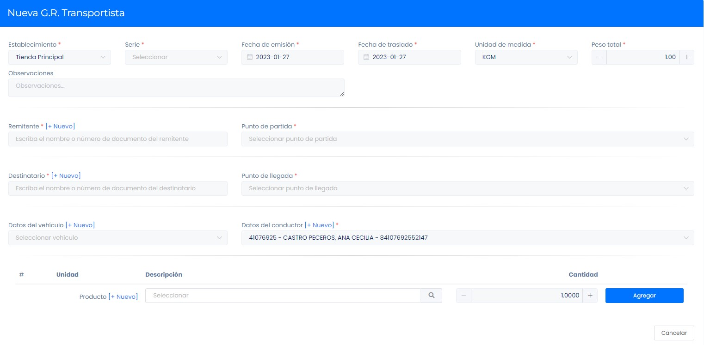
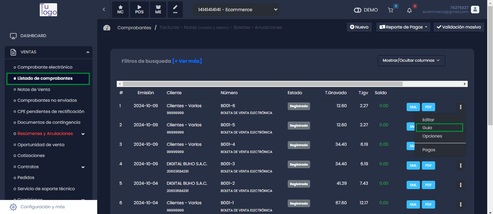

# Generar guías de remisión

:::danger IMPORTANTE:

**IMPORTANTE:** Por disposición de SUNAT con respécto a las guías de remisión, es necesario agregar tokens de conexión adicionales, tenemos una guia preparada en este **[artículo](https://fastura.github.io/documentacion/configuracion/Configuracion-previa-guia-remision)**.
:::

En este artículo te enseñaremos a como generar tus guías de remisión. Sigue estos pasos para realizarlo:

## Crear guía de remisión: Botón nuevo

Ingresa al módulo de **Comprobantes avanzados** en la subcategoría **Guías de remisión** y selecciona **G.R Remitente**. En la parte superior derecha selecciona el botón **Nuevo**.

Tendrá que rellenar los siguientes campos necesarios:

- **Establecimiento:** Selecciona el establecimiento.
- **Serie:** Selecciona la serie.
- **Fecha de emisión:** Ingresa la fecha de emisión.
- **Fecha de traslado:** Ingresa la fecha de traslado.
- **Cliente:** Selecciona el cliente, si no está creado, podrá realizarlo paso a paso en este [artículo](#Clientes : Creación Individual) artículo, también puede crear un nuevo cliente seleccionando el botón **+Nuevo**.
- **Modo de traslado:** Selecciona si el modo es transporte privado o público.

:::danger IMPORTANTE:
 El transporte privado es cuando cuenta con una movilidad para el traslado, si usted va a realizar el envío por agencia selecciona transporte público.
:::
- **Motivo de traslado:** Selecciona el motivo que más se acomode a sus requerimientos.
- **Unidad de medida:** Selecciona la unidad de medida que más se acomode a sus requerimientos.
- **Peso total:** Ingresa el peso total del producto.
- **Número de paquetes:** Ingresa el número de paquetes que va a trasladar.

**Datos de envío :**

- **Punto de partida:** Selecciona el punto de partida correspondiente, también puede crear un nuevo punto de partida seleccionando el botón **+ Nuevo.**
- **Punto de llegada:** Selecciona el punto de llegada, también puede crear un nuevo punto de llegada seleccionando el botón **+Nuevo**.

:::danger IMPORTANTE:

**IMPORTANTE:**

Si el punto de llegada no carga una vez seleccionado el cliente, selecciona el botón **+ Nuevo** y sin necesidad de llenar algún dato seguido selecciona el botón **Buscar** y una vez cargado los datos selecciona el botón **Guardar**
:::

## Datos modo de traslado: En caso sea  transporte privado

- **Datos del conductor:** Selecciona el conductor, también puede crear un nuevo conductor seleccionando el botón **+Nuevo**.
- **Datos del vehículo:** Selecciona el número de placa del vehículo que realizará el traslado, también puede crear un nuevo vehículo seleccionando el botón **+Nuevo**.

## Datos modo de traslado: En caso sea  transporte público

- Datos del transportista: Selecciona el transportista, también puede crear un nuevo transportista seleccionando el botón **+Nuevo**.

:::info IMPORTANTE
**IMPORTANTE:**
* Las unidades de medida según SUNAT, ahora son solo dos: **KGM, TNE.*
* El sistema agarra por defecto la dirección del cliente seleccionado, si desea poner otra dirección puede agregarla desde el módulo clientes agregando un nuevo campo de dirección.
* Para registrar la empresa de transportistas es obligatorio el MTC, puede solicitarlo a este link:
**[https://www.mtc.gob.pe/tramitesenlinea/tweb_tLinea/tw_consultadgtt/Frm_rep_intra_mercancia.aspx.](https://www.mtc.gob.pe/tramitesenlinea/tweb_tLinea/tw_consultadgtt/Frm_rep_intra_mercancia.aspx.)***
* La placa del vehículo no puede contener guiones ni minúsculas.*

:::

## Agregar producto

Para agregar el producto que va a trasladar

.jpg)

- **Producto:** Ingresa el nombre del producto en descripción, selecciona, en caso desee crear un nuevo producto, selecciona el botón **Nuevo** y sigue los pasos en este [artículo](#Productos: Creación Básica).
- **Cantidad:** Ingresa la cantidad del producto.

Una vez completado los campos de producto, selecciona el botón Agregar, selecciona el botón **Generar**.

## Crear guía de remisión a partir de un comprobante

En este caso usaremos una factura desde la lista de comprobantes.

Selecciona los tres puntos de la parte derecha y seguido selecciona Guía. Nos redirigirá a Guías de remisión.

Algunos campos se completarán con la información de la factura.

Se rellenará los campos faltantes de la misma manera ya explicada anteriormente.
