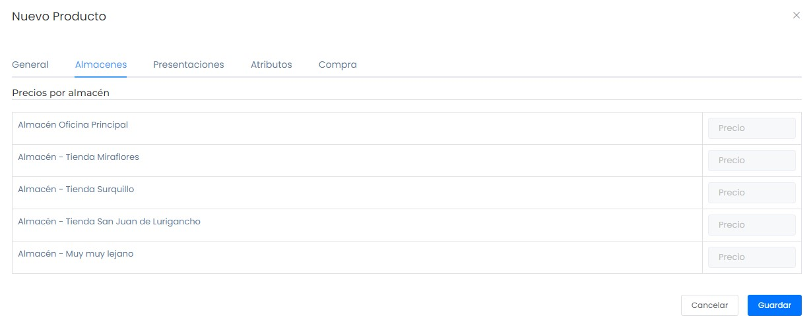
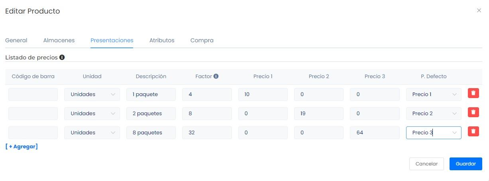
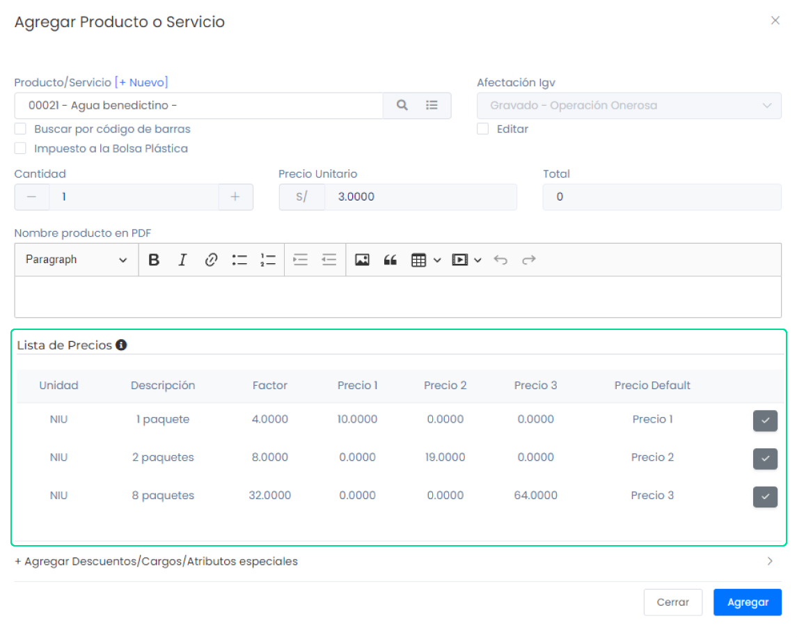
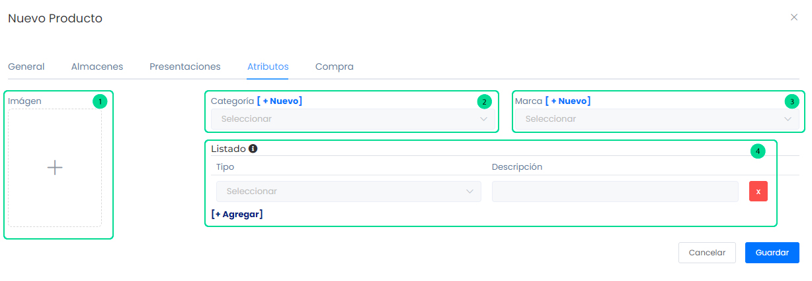
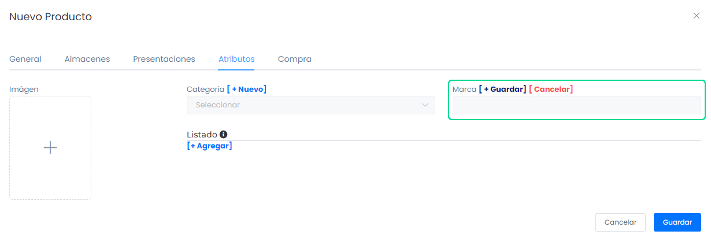

# Creación avanzada

En esta área te ayudaremos a crear productos de una manera más detallada. Sigue estos pasos para realizarlo:

## Crear producto

Ingresa al módulo de **Productos/Servicios** y luego selecciona subcategoría Productos.

En la parte superior derecha selecciona el botón **Nuevo.**

Posteriormente aparecerá el formulario para llenar los datos del **Nuevo producto.**

## Sección general

**1.  Incluye IGV:** Selecciona la casilla de selección para aplicar IGV en su producto.

**2.  Calcular cantidades por precio:** Selecciona la casilla de selección si el producto se vende por metros o por peso(ayuda a utilizar decimales).

**3.  Impuesto a la bolsa plástica:** Selecciona la casilla de selección para aplicar el impuesto a la bolsa plástica en su producto.

**4.  Nombre:** Ingresa el nombre del producto.

**5.  Nombre Secundario:** Ingresa el nombre secundario del producto.

**6.  Descripción:** Ingresa la descripción del producto.

**7.  Modelo:** Ingresar el modelo del producto en caso lo tenga.

**8.  Unidad:** Selecciona las unidades que se amolden a su servicio.

**9.  Moneda:** Selecciona el tipo de moneda en soles o dólares.

**10.  Precio Unitario:** Ingresa el precio del producto.

**11.  Tipo de afectación:** Por defecto se selecciona **Gravado - Operación Onerosa** en caso de que utilice un tipo de afectación de IGV distinto, puede seleccionarlo.

:::danger IMPORTANTE:
Consulte con su contador si tiene dudas sobre que tipo de afectación deberá utilizar.
:::

**12.  Almacén:** Selecciona en qué almacén se va a ubicar el producto.

**13.  Stock inicial:** Ingresa la cantidad de unidades del producto.

**14.  Stock Mínimo:** Ingresa la cantidad mínima de stock; la cantidad mínima de existencias de un producto que se puede permitir tener en su almacén.

:::danger IMPORTANTE:
Para habilitar la venta con restricción del stock mínimo, se tiene que configurar desde el módulo **Configuración** en la sección **Avanzado** y la subcategoría **Inventarios.** Posteriormente deberá activar el botón **Venta con restricción de stock.**
:::

**15.  Fec. Vencimiento:** Ingresa la fecha de vencimiento del producto.

**16.  Código de barra:** En caso el producto ya tenga un código de barra, deberá ingresarlo.

**17.  Código interno:** Identifica el producto, ayuda a la gestión de inventarios.Es importante colocar el código interno para que los productos puedan visualizarse en su Tienda Virtual.

:::danger IMPORTANTE:
Si no cuenta con un código interno en su empresa puede configurar automáticamente desde el módulo **Configuración** en la sección **Avanzado** y la subcategoría **Inventarios.** Posteriormente deberá activar el botón **Generar automáticamente código interno del producto.**
:::

**18.  Código SUNAT:** Inserta código sunat, este código se lo proporciona la SUNAT.

:::danger IMPORTANTE:
Insertar el código si la **SUNAT** lo requiere.
:::

**19.  Línea de producto:** Inserta la línea de producto, grupo de productos que tienen relación directa entre sí.

**20.  Código de fábrica:** Inserta el código de fábrica, en el caso de productos tecnológicos cuentan con un código de fábrica.

**21.  Incluye percepción:** Selecciona la casilla de selección si el producto incluye percepción; algunos productos cuentan con percepción adicional al IGV. Añada el porcentaje de percepción de acuerdo a su régimen en caso lo requiera.

**22.  ¿Maneja lotes?:** Selecciona la casilla de selección para añadir el código de lote que se encuentra en el producto.

**23.  ¿Maneja series?:** Selecciona la casilla de selección para añadir el código de serie que se encuentra en el producto.

**24.  Este producto, ¿requiere insumos?:** Selecciona la casilla si el producto va a ser utilizado en el módulo de producción.

**25.  Incluye ISC (Impuesto selectivo al consumo):** Selecciona la casilla de selección para aplicar ISC; elija el Tipo de sistema ISC que requiera; ingrese el porcentaje.

**26.  Sujeto a detracción:** Selecciona la casilla si el producto está sujeto a detracción.

## Sección almacenes

Podrá colocar diferentes precios del producto según el almacén.Es decir el mismo producto podrá tener diferentes precios en diferentes almacenes.

## Sección presentaciones

Es otra manera de agregar precios del producto sin alterar los precios en el almacén.Te permite añadir diferentes presentaciones.

:::danger IMPORTANTE:
Verificar en qué casilla están colocados los precios y seleccionar la casilla en **P.Defecto.**
:::

De esta manera podrá emitir el comprobante electrónico de la manera más fácil, ya que contará con el acceso en la parte posterior al seleccionar el producto, asimismo podrá elegir el producto según lo que su cliente solicite.

Selecciona la **casilla de confirmación** si desea agregar el producto.

## Sección atributos

**1.  Imagen:** Inserta la imagen del producto.

**2.  Categoría:** Selecciona la categoría del producto, caso contrario deberá crearlo seleccionando el botón **[+Nuevo].**

Deberá escribir el nombre de la categoría que desee crear y después seleccionar el botón  **[+Guardar].**

**3.  Marca:** Selecciona la marca del producto, caso contrario deberá crearlo seleccionando el botón **[+Nuevo].**

Deberá escribir el nombre de la marca que desee crear y después seleccionar el botón  **[+Guardar].**

**4.  Listado:** Selecciona el botón **[+Agregar]** para agregar una lista de atributos, selecciona el tipo y añada una descripción si lo cree necesario.

## Sección compra

**1.  Precio Unitario:** Inserta el precio unitario del costo del producto.

**2.  Incluye IGV:** Selecciona la casilla de selección si el producto lo adquirió con IGV.

**3.  Aplica ganancia:** Selecciona la casilla de selección si desea sacar un porcentaje de ganancia; seguido inserte el porcentaje de ganancia que desee adquirir.

**4.  Incluye ISC (Impuesto selectivo al consumo):** Selecciona la casilla de selección si **corresponde a su rubro**.Seguido selecciona el Tipo de sistema **ISC**; el porcentaje **ISC.**

Después selecciona el botón **Guardar**, y se observará el Listado de productos, donde podrá visualizar su producto agregado.
